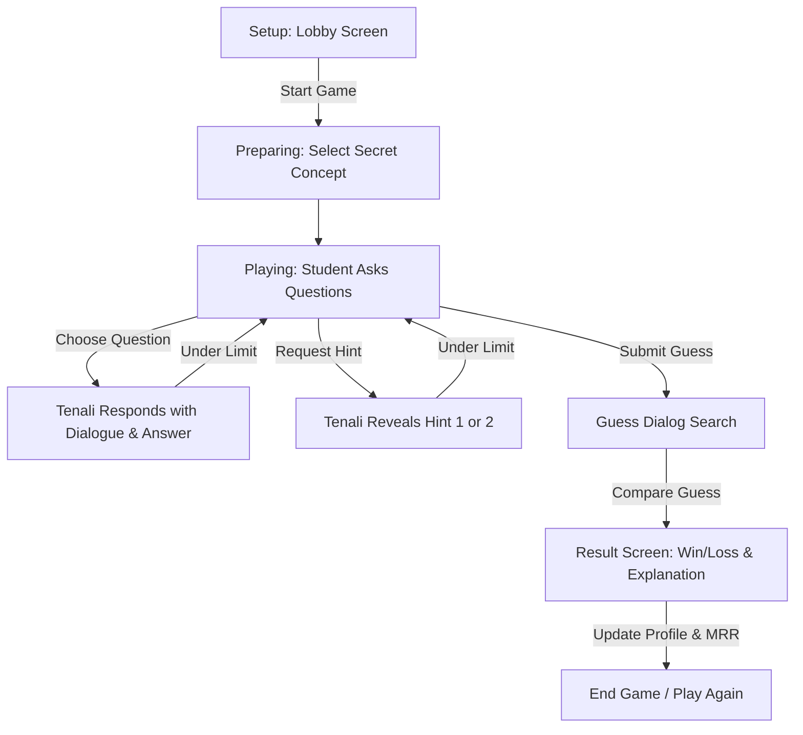

# Tenali Reverse Mind Reader (Student as the Guesser)

This document provides a comprehensive technical reference for the **Tenali Reverse Mind Reader** feature, a role-reversed math guessing game. In this game, Tenali secretly selects a mathematical concept, and the student tries to guess it by asking questions and requesting hints.

This file acts as a living document (`feature2.md`) and tracks all implemented features, backend APIs, frontend states, database schemas, and mathematical concepts for this version.

---

## 1. Status Dashboard & Features Summary

All features for the new "Reverse Mind Reader" game are currently in the design and planning phase.

| Feature Area | Description | Implementation Status |
|---|---|---|
| **Phase 1: Core Architecture** | Core game loop, game states, rules, and constraints | 🟢 Implemented (Backend + Frontend) |
| **Phase 2: Knowledge Base** | Concept schema extension, attributes, hints, and dialogue | 🟢 Implemented ([mindReaderKB2.js](file:///d:/Projects/Tenali/server/mindReaderKB2.js)) |
| **Phase 3: Question System** | Predefined categories, question library, validation | 🟢 Implemented (Predefined library validated) |
| **Phase 4: Backend APIs** | APIs for `/start`, `/question`, `/hint`, `/guess`, `/end` | 🟢 Implemented (Endpoints verified via tests) |
| **Phase 5: Frontend UI** | Layout, category navigation, search guess dialog, results | 🟢 Implemented ([MindReaderApp2.jsx](file:///d:/Projects/Tenali/client/src/MindReaderApp2.jsx)) |
| **Phase 6: Avatar Expressions** | SVG avatar expressions linked to dialogue feedback | 🟢 Implemented (Dynamic expression transitions mapped) |
| **Phase 7: Reward System** | MRR updates, streak bonuses, title unlocks, skins | 🟢 Implemented (In-memory rewards cabinet drawer) |
| **Phase 8: Telemetry & Analytics** | Tracking metrics, question orders, wrong guesses | 🔴 Not Started |

---

## 2. Directory Structure & Key Files (Planned)

The code changes will be localized within these key components:
- **Knowledge Base & Dialogues**: [mindReaderKB.js](file:///d:/Projects/Tenali/server/mindReaderKB.js) (or a new module `mindReaderKB2.js` to prevent breaking existing game flows) - Will store the expanded concepts dictionary, attributes, predefined question library, and personality dialogues.
- **Backend Endpoints & Caching**: [index.js](file:///d:/Projects/Tenali/server/index.js) (under a new route block `TENALI REVERSE MIND READER API`) - Implements Express routes, in-memory session caching, response matching, and rating calculations.
- **Database Models & Analytics**: [auth.js](file:///d:/Projects/Tenali/server/auth.js) - Integrates the user profile properties and the `MindReaderAnalytic` schema.
- **Frontend App Component**: [App.jsx](file:///d:/Projects/Tenali/client/src/App.jsx) (inside `MindReaderApp` or a new component `MindReaderApp2`) - Handles game loops, state machine, autocomplete search guess dialog, API requests, avatar rendering, and layout.

---

## 3. Game Flow & Rules

### A. The Core Game Loop


### B. MVP Game Rules
- **Questions Allowed**: Up to 10 questions per session.
- **Hints Available**: Up to 2 hints per session (Hint 1 is General, Hint 2 is Specific).
- **Guesses Allowed**: Exactly 1 final guess.
- **Difficulty**: Easy (MVP) - Concept Pool consists of 20–30 curriculum-aligned math topics.
- **Time Limit**: None.

### C. Game States
The frontend transitions through these states:
1. `SETUP`: Lobby screen presenting the start story ("I have hidden one mathematical secret. Can you discover it?").
2. `PREPARING`: Loading/selecting animation ("Selecting today's challenge...").
3. `PLAYING`: Core questioning view showing status counters, categories, and conversation history.
4. `GUESSING`: Interactive dialog box with autocomplete search and concept list select.
5. `GAME_OVER`: Final results view showing correct answer, explanations, rating adjustment, and rewards.

---

## 4. Knowledge Base & Attributes Schema

### A. Extended Concept Schema
Every concept in the dictionary will contain the following keys:
```javascript
{
  id: "prime_number",
  name: "Prime Number",
  category: "Number Concepts",
  difficulty: "easy",
  definition: "A whole number greater than 1 with exactly two positive divisors: 1 and itself.",
  examples: ["2", "3", "5", "7", "11"],
  attributes: {
    isGeometry: false,
    isAlgebra: false,
    isNumber: true,
    isFormula: false,
    isOperation: false,
    isTheorem: false,
    usesDiagram: false,
    containsVariables: false,
    usesFractions: false,
    hasGraph: false,
    requiresCalculation: false,
    realWorldApplication: true,
    gradeLevel: 6
  },
  hints: {
    hint1: "It belongs to Number Theory.",
    hint2: "Every positive integer greater than one is classified using me."
  },
  funFact: "The number 2 is the only even prime number. All other prime numbers are odd!",
  relatedLesson: "Factors and Multiples",
  commonMistakes: "Many students confuse prime numbers with odd numbers, thinking 9 or 15 are primes when they are composite."
}
```

### B. Personality Responses
Tenali returns conversational dialogue corresponding to his answers. To avoid repetition, the backend holds lists of template strings and selects one randomly:
- **Positive Responses (`YES` value)**: *"You are getting warmer! Indeed."*, *"Spot on! That is correct."*, *"My abacus agrees. Yes!"*
- **Negative Responses (`NO` value)**: *"Alas, no."*, *"Not at all, try looking in another direction."*, *"That path leads to a dead end. No."*
- **Unknown Responses (`null` value)**: *"The mathematical ether is blurry on this one. I do not know."*, *"A mystery! I cannot give a clear answer."*
- **Hint Responses**: *"A clue emerges..."*, *"Lean in, here is a secret..."*
- **Winning Responses (Player Guesses Correctly)**: *"A brilliant victory! You successfully deciphered my secret."*, *"Outstanding! I bow to your logical deduction."*
- **Losing Responses (Player Out of Questions or Guesses Wrong)**: *"Aha! My secret remains safe. Better luck next time!"*, *"The abacus wins today. I was thinking of..."*

---

## 5. Question Library & Categories

Predefined questions (40–60 items) categorized under specific themes. The student selects a category first, then clicks a question:

### Categories & Sample Questions
1. **Definition**
   - *Is it a theorem?*
   - *Is it a formula?*
   - *Is it a number?*
   - *Is it a mathematical operation?*
2. **Category**
   - *Does it belong to Algebra?*
   - *Does it belong to Geometry?*
   - *Does it belong to Statistics?*
   - *Does it belong to Arithmetic?*
3. **Properties**
   - *Does it use variables?*
   - *Does it require diagrams?*
   - *Does it involve equations?*
   - *Does it involve factors?*
4. **Applications**
   - *Is it used in real life?*
   - *Is it useful in programming?*
   - *Does it appear in exam questions?*

---

## 6. Backend API Reference

All game session parameters are cached in-memory on the backend, keyed by a unique `gameId`.

### `POST /api/game/start`
Starts a new game session.
- **Request Body**: `{}` (optional jwt header for authenticated profile)
- **Response**:
  ```json
  {
    "gameId": "sess_89dfa89df232",
    "questionsRemaining": 10,
    "hintsRemaining": 2,
    "state": "PLAYING"
  }
  ```

### `POST /api/game/question`
Asks a specific question.
- **Request Body**:
  ```json
  {
    "gameId": "sess_89dfa89df232",
    "questionId": "q_algebra_check"
  }
  ```
- **Response**:
  ```json
  {
    "dialogue": "Spot on! That is correct.",
    "answer": "yes",
    "questionsRemaining": 9
  }
  ```

### `POST /api/game/hint`
Retrieves the next available hint.
- **Request Body**:
  ```json
  {
    "gameId": "sess_89dfa89df232"
  }
  ```
- **Response**:
  ```json
  {
    "dialogue": "A clue emerges: It belongs to Number Theory.",
    "hint": "It belongs to Number Theory.",
    "hintsRemaining": 1
  }
  ```

### `POST /api/game/guess`
Submits the final concept guess.
- **Request Body**:
  ```json
  {
    "gameId": "sess_89dfa89df232",
    "guess": "Prime Number"
  }
  ```
- **Response**:
  ```json
  {
    "correct": true,
    "reward": {
      "mrrChange": 25,
      "xpEarned": 100
    },
    "concept": {
      "name": "Prime Number",
      "definition": "A whole number greater than 1 with exactly two positive divisors: 1 and itself.",
      "examples": ["2", "3", "5", "7", "11"],
      "funFact": "The number 2 is the only even prime number.",
      "relatedLesson": "Factors and Multiples"
    }
  }
  ```

---

## 7. Frontend Layout & Visual System

### UI Gameplay Layout
```
------------------------------------------------------
  🔮 MRR: 1040   |  💬 Questions: 8/10  |  💡 Hints: 2/2
------------------------------------------------------
                     (\_/)
                     (o.o)   <- Tenali Avatar
                    (>   <)
            
         "Spot on! That is correct." <- Speech Bubble
------------------------------------------------------
  Question Categories:
  [ Definition ]  [ Category ]  [ Properties ]  [ Apps ]
------------------------------------------------------
  Questions List (Category: Properties)
  - [Ask] Does it require diagrams?
  - [Ask] Does it involve factors?
  - [Disabled] Does it use variables? (Already Asked)
------------------------------------------------------
  Conversation History:
  - Student: Does it use variables?
    Tenali: "Alas, no."
------------------------------------------------------
  [ Submit Final Guess Button ]
------------------------------------------------------
```

### Avatar Expressions
Tenali's expressions change dynamically based on the dialogue response:
- `thinking`: When the player is selecting a category or when the session is initializing.
- `happy`: When the student gets a positive answer (`yes` value).
- `serious`: When the student gets a negative answer (`no` value).
- `hinting`: When Tenali is delivering a hint clue.
- `impressed`: When the student submits a correct guess.
- `proud`: When the student guesses incorrectly and loses.
