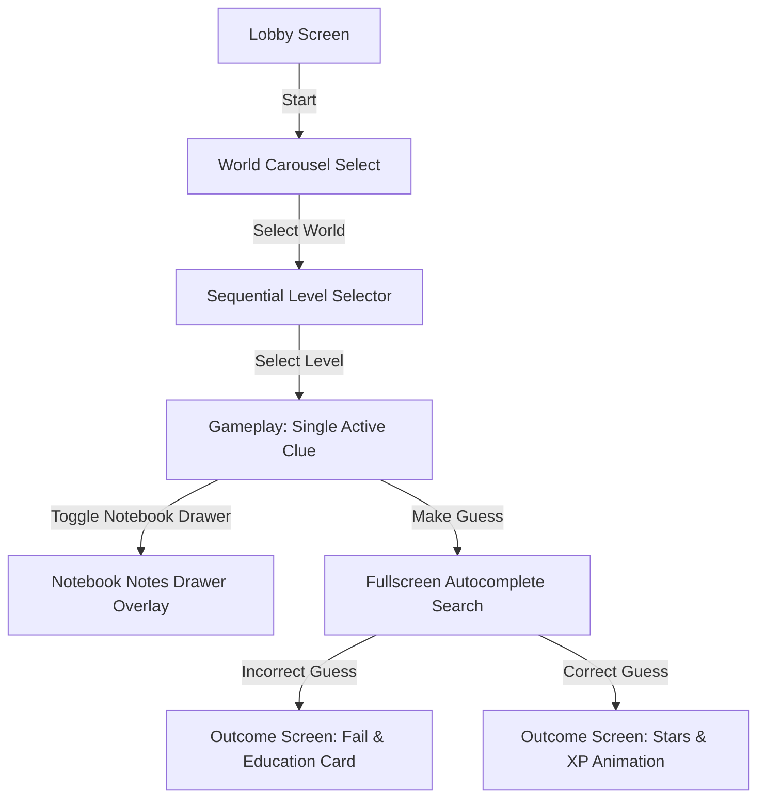

# Feature Specification — Guess What's On Tenali's Mind

This document serves as the living technical specification (`feature2.md`) for the **Guess What's On Tenali's Mind** feature. It details the game mechanics, user progression states, database schema extensions, backend API endpoints, and sequential, clutter-free visual interfaces.

---

## 1. Feature Overview & Design Goals

"Guess What's On Tenali's Mind" is a role-reversed educational guessing game designed to motivate revision and active recall. In this game, Tenali selects a secret mathematical concept associated with a chosen level, and the student must deduce it using progressive clues and clues-filtering hints.

### Core Objectives
*   **Active Recall**: Guide students to recall mathematical definitions, traits, and properties by interpreting clue sequences.
*   **Zero-Inference Latency**: Run entirely on predefined structured JSON configurations, avoiding slow and expensive LLM operations.
*   **Gamified Replayability**: Encourage replayability through a level map, performance stars ($0-3$), and XP rewards.
*   **Minimal & Sequential UI**: Avoid split screens, side-by-side elements, and overwhelming dashboard panels. Keep interactions focused on one clean task at a time.

---

## 2. Directory Structure & Key Files

The implementation spans the following files:
*   **Content Configuration Database**:
    *   [worlds.json](file:///d:/Projects/Tenali/server/data/worlds.json) - Kingdom boundaries, order, and unlocks.
    *   [levels.json](file:///d:/Projects/Tenali/server/data/levels.json) - Map coordinates and concept assignments.
    *   [concepts.json](file:///d:/Projects/Tenali/server/data/concepts.json) - Clues, hints, definitions, and educational details.
*   **Backend Middleware & Endpoints**: [index.js](file:///d:/Projects/Tenali/server/index.js) (under `GUESS WHAT'S ON TENALI'S MIND API`) - Implements Express routes, cache stores, and reward modifiers.
*   **User Persistence Models**: [auth.js](file:///d:/Projects/Tenali/server/auth.js) - Schema updates for kingdoms unlocking, stars, and XP tracking.
*   **Frontend Game Dashboard**: [App.jsx](file:///d:/Projects/Tenali/client/src/App.jsx) (inside `GuessMindApp`) - Renders the Candy Crush roadmap, clues list, scratch notes, and results.

---

## 3. Sequential Game Flow & States

To ensure a clutter-free user experience, every view is rendered in a sequential card layout.



### Game Rules
1.  **Clues Timeline**: Every level contains exactly 5 progressive clues, starting with Clue 1. The user manually clicks to reveal subsequent clues, or guesses immediately.
2.  **Clue-based Hints**: Up to 3 hints are available per level. Revealing a hint decreases the final reward payout.
3.  **Single Final Guess**: The student has exactly one guess attempt. An incorrect guess immediately ends the level run, revealing the concept and its associated tutorial card.
4.  **Locks & World Progression**:
    *   There are 5 worlds: *Arithmetic Kingdom, Geometry Kingdom, Algebra Kingdom, Statistics Kingdom, Trigonometry Kingdom*.
    *   Worlds unlock based on cumulative XP.
    *   Levels within a world unlock sequentially; level $N$ requires level $N-1$ completed with $\ge 1$ star.

---

## 4. Database Schema Extensions (`server/auth.js`)

We store progression parameters under the `User` model:
*   `xp`: User's total accumulated experience points (defaults to `0`).
*   `worldProgress`: Stores unlock states for each world category.
*   `levelProgress`: Maps completions, records star ratings ($0-3$), and high scores.
*   `MindReaderAnalytic2`: Captures game runs, total guesses, hints used, and completion times for dashboard analytics.

---

## 5. API Reference

All requests must supply the standard `Authorization: Bearer <token>` header for authenticated users. Guest sessions fallback to local client storage.

### `GET /api/mindreader/worlds`
Loads the kingdoms list, locking status, and level performance stars.
*   **Response**:
    ```json
    {
      "xp": 620,
      "worlds": [
        { "worldId": "arithmetic_kingdom", "worldName": "Arithmetic Kingdom", "unlocked": true, "stars": 12 },
        { "worldId": "geometry_kingdom", "worldName": "Geometry Kingdom", "unlocked": true, "stars": 0 }
      ],
      "levelProgress": [
        { "levelNum": 1, "conceptId": "prime_number", "starsEarned": 3 }
      ]
    }
    ```

### `POST /api/mindreader/start`
Starts a level run. Selects the secret concept and generates a session.
*   **Request Body**: `{ "levelNum": 1 }`
*   **Response**:
    ```json
    {
      "gameId": "sess_389279432",
      "levelNum": 1,
      "clue": "I belong to the world of numbers.",
      "clueIndex": 0,
      "hintsRemaining": 3
    }
    ```

### `POST /api/mindreader/next-clue`
Reveals the next progressive clue.
*   **Request Body**: `{ "gameId": "sess_389279432" }`
*   **Response**:
    ```json
    {
      "clue": "I always have exactly two positive divisors.",
      "clueIndex": 1,
      "cluesExhausted": false
    }
    ```

### `POST /api/mindreader/use-hint`
Loads the next hint.
*   **Request Body**: `{ "gameId": "sess_389279432" }`
*   **Response**:
    ```json
    {
      "hint": "I am an Arithmetic category topic.",
      "hintsRemaining": 2
    }
    ```

### `POST /api/mindreader/submit-guess`
Compares the guess with the secret concept, logs telemetry, updates user database, and returns the result card.
*   **Request Body**: `{ "gameId": "sess_389279432", "guess": "Prime Number" }`
*   **Response**:
    ```json
    {
      "correct": true,
      "actualConcept": "Prime Number",
      "starsEarned": 3,
      "mrrChange": 30,
      "xpEarned": 150,
      "educationalInfo": {
        "definition": "A whole number greater than 1 with exactly two positive divisors: 1 and itself.",
        "examples": ["2", "3", "5", "7", "11"],
        "commonMistakes": "Confusing prime numbers with odd numbers.",
        "funFact": "2 is the only even prime number.",
        "relatedLesson": "Factors and Multiples",
        "practiceQuestions": ["Is 29 prime?", "Is 1 prime?"]
      }
    }
    ```

---

## 6. Frontend Sequential Screen Mockups

### Screen 1: World Carousel Select (Single Focused Item)
```
==============================================================
                      <  WORLD 1 OF 5  >
             
              👑 ARITHMETIC KINGDOM (12 ⭐)
                     Unlocked (0 XP)
              
                 [ Enter Kingdom Button ]
==============================================================
```

### Screen 2: Level Selection (Vertical Track)
```
==============================================================
                [<- Back to Kingdoms]
                
                    ( Level 3 ) [🔒]
                           |
                    ( Level 2 ) [⭐]
                           |
                   ( Level 1 ) [⭐⭐⭐] (Prime Number)
==============================================================
```

### Screen 3: Gameplay Clue Dashboard (One Clue Only)
```
==============================================================
  🏆 Level 1  |  💡 Hints: 2/3  |  ⭐ Stars Potential: 3
==============================================================
  
    "I belong to the world of numbers." (Clue 1 of 5)
    
            *  o  o  o  o  <- Progress Timeline
    
    --------------------------------------------------------
    [📝 Notes] | [💡 Get Hint] | [🔎 Make Guess] | [Next Clue ->]
==============================================================
```

### Screen 4: Fullscreen Fuzzy Search Guess overlay
```
==============================================================
                   [<- Close Guess Mode]
             
             Type concept... [ Prime                      ]
             
             Matching Concepts:
             - [Prime Number]
             - [Prime Factorization]
==============================================================
```

### Screen 5: Outcome & Educational Details Review
```
==============================================================
                        🎉 CORRECT!
                   +30 MRR  |  +150 XP  |  ⭐⭐⭐
                   
             Definition: A whole number greater than 1 with
             exactly two divisors: 1 and itself.
             
             Examples: 2, 3, 5, 7, 11, 13
             
             Related Lesson: Factors and Multiples
             
                    [ Next Level Map -> ]
==============================================================
```

---

## 7. SVG Avatar Dialogue Reactions
*   `thinking`: Default waiting stance, neutral eyes.
*   `happy`: Raised eyebrows and smirking mouth when a clue is successfully unlocked.
*   `hinting`: Winking expression while presenting a hint.
*   `impressed`: Large smile, glittering eyes on correct guess completions.
*   `proud`: Smug arms-crossed smirk when the user guesses incorrectly and fails.
