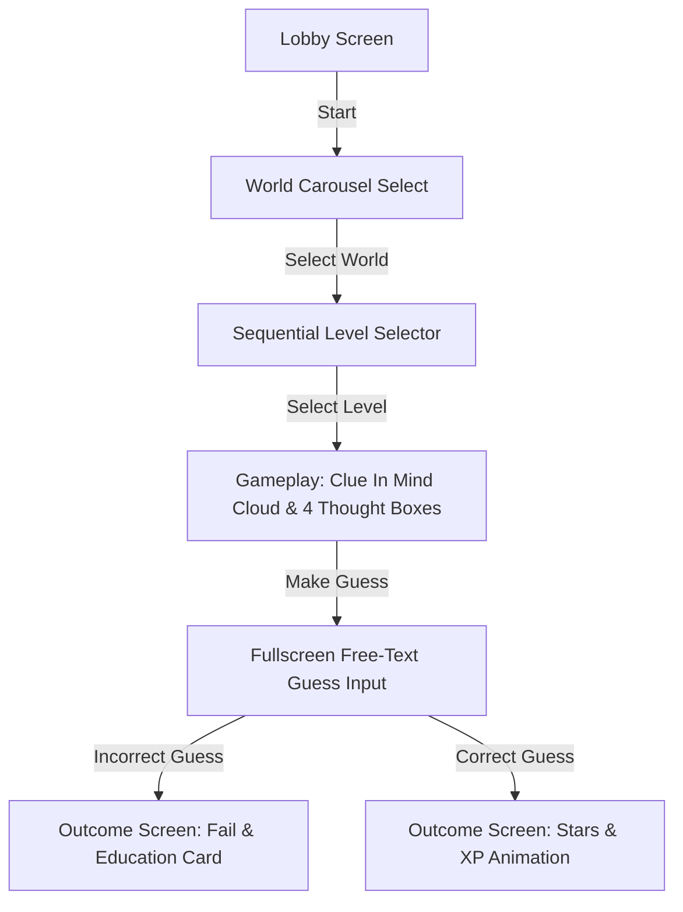

# Feature Specification — Guess What's On Tenali's Mind

This document serves as the living technical specification (`feature2.md`) for the **Guess What's On Tenali's Mind** feature. It details the game mechanics, user progression states, database schema extensions, backend API endpoints, and sequential, clutter-free visual interfaces.

---

## 1. Feature Overview & Design Goals

"Guess What's On Tenali's Mind" is a role-reversed educational guessing game designed to motivate revision and active recall. In this game, Tenali selects a secret mathematical concept associated with a chosen level, and the student must deduce it using progressive clues and clues-filtering hints.

### Core Objectives
*   **Active Recall**: Guide students to recall mathematical definitions, traits, and properties by interpreting clue sequences.
*   **Zero-Inference Latency**: Run entirely on predefined structured JSON configurations, avoiding slow and expensive LLM operations.
*   **Gamified Replayability**: Encourage replayability through a level map, performance stars ($0-3$), and XP rewards.
*   **Minimal & Sequential UI**: Avoid split screens, side-by-side elements, and overwhelming dashboard panels. Keep interactions focused on one clean task at a time.

---

## 2. Directory Structure & Key Files

The implementation spans the following files:
*   **Content Configuration Database**:
    *   [worlds.json](file:///d:/Projects/Tenali/server/data/worlds.json) - Kingdom boundaries, order, and unlocks.
    *   [levels.json](file:///d:/Projects/Tenali/server/data/levels.json) - Map coordinates and concept assignments.
    *   [concepts.json](file:///d:/Projects/Tenali/server/data/concepts.json) - Clues, hints, definitions, and educational details.
*   **Backend Middleware & Endpoints**: [index.js](file:///d:/Projects/Tenali/server/index.js) (under `GUESS WHAT'S ON TENALI'S MIND API`) - Implements Express routes, cache stores, and reward modifiers.
*   **User Persistence Models**: [auth.js](file:///d:/Projects/Tenali/server/auth.js) - Schema updates for kingdoms unlocking, stars, and XP tracking.
*   **Frontend Game Dashboard**: [App.jsx](file:///d:/Projects/Tenali/client/src/App.jsx) (inside `GuessMindApp`) - Renders the Candy Crush roadmap, clues list, scratch notes, and results.

---

## 3. Sequential Game Flow & States

To ensure a clutter-free user experience, every view is rendered in a sequential card layout.


```mermaid
graph TD
    A[Lobby Screen] -->|Start| B[World Carousel Select]
    B -->|Select World| C[Sequential Level Selector]
    C -->|Select Level| D[Gameplay: Clue In Mind Cloud & 4 Thought Boxes]
    D -->|Make Guess| E[Fullscreen Free-Text Guess Input]
    E -->|Incorrect Guess| F[Outcome Screen: Fail & Education Card]
    E -->|Correct Guess| G[Outcome Screen: Stars & XP Animation]
```

### Game Rules
1.  **Mind Cloud Clues**: Clue sequences are revealed directly inside Tenali's mind speech cloud. There are no separate clue cards below.
2.  **Guessed Topics (4 Thought Boxes)**: The student has 4 inline text input boxes on-screen to write candidate concepts as they narrow down their thoughts. No separate collapsible note section is used.
3.  **Clue-based Hints**: Up to 3 hints are available per level. Revealing a hint decreases the final reward payout.
4.  **Free-Text Guesses**: When the student clicks "Guess", they are presented with a simple input textbox to type their guess. No concept list or dropdown is provided.
5.  **Single Final Guess**: The student has exactly one guess attempt. An incorrect guess immediately ends the level run, revealing the concept and its associated tutorial card.
6.  **Locks & World Progression**:
    *   There are 5 worlds: *Arithmetic Kingdom, Geometry Kingdom, Algebra Kingdom, Statistics Kingdom, Trigonometry Kingdom*.
    *   Worlds unlock based on cumulative XP.
    *   Levels within a world unlock sequentially; level $N$ requires level $N-1$ completed with $\ge 1$ star.

---

## 4. Database Schema Extensions (`server/auth.js`)

We store progression parameters under the `User` model:
*   `xp`: User's total accumulated experience points (defaults to `0`).
*   `worldProgress`: Stores unlock states for each world category.
*   `levelProgress`: Maps completions, records star ratings ($0-3$), and high scores.
*   `MindReaderAnalytic2`: Captures game runs, total guesses, hints used, and completion times for dashboard analytics.

---

## 5. API Reference

All requests must supply the standard `Authorization: Bearer <token>` header for authenticated users. Guest sessions fallback to local client storage.

### `GET /api/mindreader/worlds`
Loads the kingdoms list, locking status, and level performance stars.
*   **Response**:
    ```json
    {
      "xp": 620,
      "worlds": [
        { "worldId": "arithmetic_kingdom", "worldName": "Arithmetic Kingdom", "unlocked": true, "stars": 12 },
        { "worldId": "geometry_kingdom", "worldName": "Geometry Kingdom", "unlocked": true, "stars": 0 }
      ],
      "levelProgress": [
        { "levelNum": 1, "conceptId": "prime_number", "starsEarned": 3 }
      ]
    }
    ```

### `POST /api/mindreader/start`
Starts a level run. Selects the secret concept and generates a session.
*   **Request Body**: `{ "levelNum": 1 }`
*   **Response**:
    ```json
    {
      "gameId": "sess_389279432",
      "levelNum": 1,
      "clue": "I belong to the world of numbers.",
      "clueIndex": 0,
      "hintsRemaining": 3
    }
    ```

### `POST /api/mindreader/next-clue`
Reveals the next progressive clue.
*   **Request Body**: `{ "gameId": "sess_389279432" }`
*   **Response**:
    ```json
    {
      "clue": "I always have exactly two positive divisors.",
      "clueIndex": 1,
      "cluesExhausted": false
    }
    ```

### `POST /api/mindreader/use-hint`
Loads the next hint.
*   **Request Body**: `{ "gameId": "sess_389279432" }`
*   **Response**:
    ```json
    {
      "hint": "I am an Arithmetic category topic.",
      "hintsRemaining": 2
    }
    ```

### `POST /api/mindreader/submit-guess`
Compares the guess with the secret concept, logs telemetry, updates user database, and returns the result card.
*   **Request Body**: `{ "gameId": "sess_389279432", "guess": "Prime Number" }`
*   **Response**:
    ```json
    {
      "correct": true,
      "actualConcept": "Prime Number",
      "starsEarned": 3,
      "mrrChange": 30,
      "xpEarned": 150,
      "educationalInfo": {
        "definition": "A whole number greater than 1 with exactly two positive divisors: 1 and itself.",
        "examples": ["2", "3", "5", "7", "11"],
        "commonMistakes": "Confusing prime numbers with odd numbers.",
        "funFact": "2 is the only even prime number.",
        "relatedLesson": "Factors and Multiples",
        "practiceQuestions": ["Is 29 prime?", "Is 1 prime?"]
      }
    }
    ```

---

### HUD & Top Header Layout Rules
1. **Lobby Screen ("Read Tenali's Mind")**: Top header displays **XP only** (`🏆 XP: {xp}`). Level and Hints counters are removed from top.
2. **Worlds Page**: Top header displays **XP only** (`🏆 XP: {xp}`). Level and Hints counters are removed from top. Each Kingdom card displays the **highest level completed in that kingdom** (e.g. `👑 Highest Level: Level 14` or `None`).
3. **Level Section**: Top header displays **only XP and highest level completed** (`🏆 XP: {xp}` and `👑 Highest Level Completed: Level {X}`). Hints and current level counters are removed from the top navigation bar.

---

## 6. Frontend Sequential Screen Mockups

### Screen 0: Home Page (Glassmorphic Hero Card & CTAs)
```
==============================================================
                     Top HUD: [🏆 XP: 1450]
                     
        ┌──────────────────────────────────────────────┐
        │          🔮 REVERSE RECALL GAME              │
        │            Read Tenali's Mind                │
        │    Deduce concepts in 5 progressive clues    │
        │                                              │
        │                 ( Avatar )                   │
        │     "I have hidden a concept in my mind..."  │
        │                                              │
        │  [👑 7 Kingdoms]  [💡 5 Clues]  [🏆 XP&Stars] │
        │                                              │
        │        [ ▶ Play Level 15 (Direct Jump) ]     │
        │        [ 👑 Explore All Kingdoms →     ]     │
        └──────────────────────────────────────────────┘
==============================================================
```

### Screen 1: World Select (Kingdom Cards with Kingdom Highest Level)
```
==============================================================
                     Top HUD: [🏆 XP: 1450]
                     
                       Select a World
             
       ┌───────────────────────────────────────────┐
       │             ARITHMETIC KINGDOM            │
       │               Levels 11–20                │
       │      👑 Highest Level: Level 14            │
       │              ⭐ 12 Stars                  │
       └───────────────────────────────────────────┘
==============================================================
```

### Screen 2: Level Selection Track
```
==============================================================
  Top HUD: [🏆 XP: 1450]  |  [👑 Highest Level Completed: Level 14]
==============================================================
                [<- Back to Worlds]
                
                    ( Level 3 ) [🔒]
                           |
                    ( Level 2 ) [⭐]
                           |
                    ( Level 1 ) [⭐⭐⭐]
==============================================================
```

### Screen 3: Gameplay Clue Dashboard (Mind Cloud + Thought Fields)
```
==============================================================
  Top HUD: [<- Map] [💡 Hint (3/3)]          [XP: 1450 XP] [🏠]
==============================================================
                Tenali's Mind • Level 1
                     Clue 1 of 5
  
                     (\_/)
                     (o.o)
                    (>   <)
            
         "I belong to the world of numbers."  <- Clue in Speech Bubble
    
     ✍️ Scratchpad (Notes)
     [ Topic 1: Prime Number          ] [ Topic 2:                      ]
     [ Topic 3:                       ] [ Topic 4:                      ]
    
    --------------------------------------------------------
    [<- Prev Clue]   |   [Verify Guess]   |   [Unlock Next Clue ->]
==============================================================
```

### Screen 4: Fullscreen Free-Text Guess Input
```
==============================================================
                   [<- Close Guess Mode]
             
             Type your final guess here:
             
             [                                        ]
             
             (Warning: You have only 1 guess attempt!)
             
             [ Confirm Guess ]
==============================================================
```

### Screen 5: Outcome & Educational Details Review
```
==============================================================
                        🎉 CORRECT!
                   +30 MRR  |  +150 XP  |  ⭐⭐⭐
                   
             Definition: A whole number greater than 1 with
             exactly two divisors: 1 and itself.
             
             Examples: 2, 3, 5, 7, 11, 13
             
             Related Lesson: Factors and Multiples
             
                    [ Next Level Map -> ]
==============================================================
```

---

## 7. SVG Avatar Dialogue Reactions
*   `thinking`: Default waiting stance, neutral eyes.
*   `happy`: Raised eyebrows and smirking mouth when a clue is successfully unlocked.
*   `hinting`: Winking expression while presenting a hint.
*   `impressed`: Large smile, glittering eyes on correct guess completions.
*   `proud`: Smug arms-crossed smirk when the user guesses incorrectly and fails.
