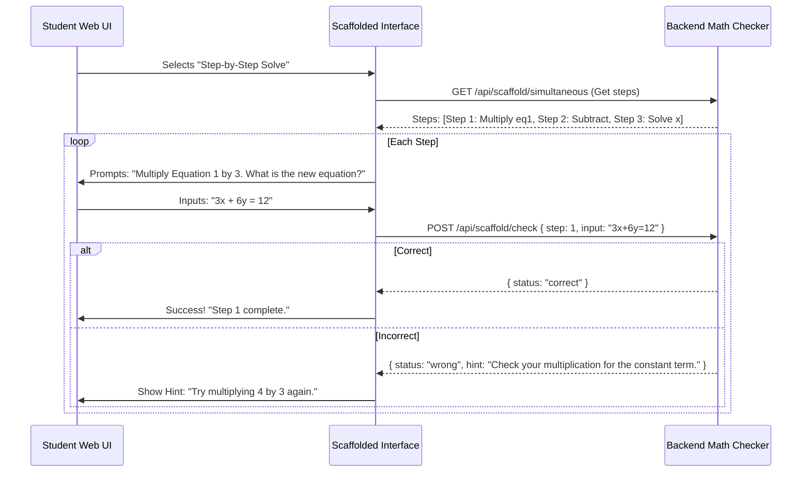
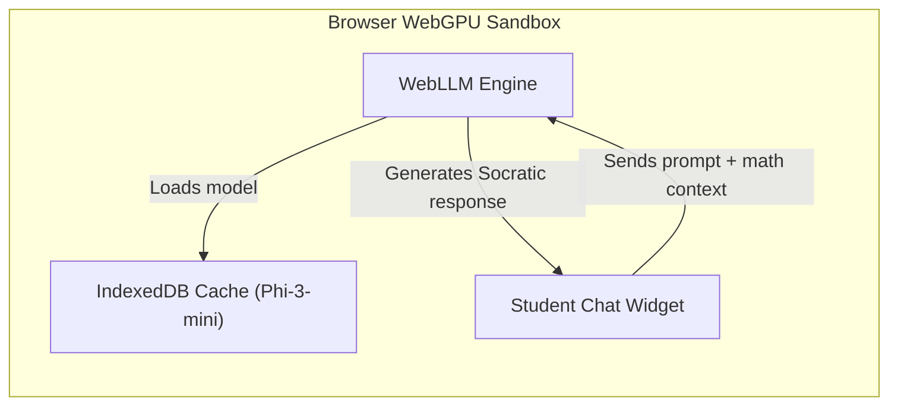

# Tenali Platform: Architectural Audit, Innovations, and Implementation Roadmap

This document presents a deep, multi-disciplinary analysis of the Tenali math quiz platform. Prepared by an expert team comprising roles from Senior Software Architect to Startup Founder, it identifies core architectural bottlenecks and details 30 unique, high-value technical suggestions. 

---

## Part 1: Current Architecture & Technical Debt Audit

Before introducing new features, we must examine the limitations and technical debt inherent in Tenali v4.0.

```mermaid
graph TD
    subgraph Client (Vite + React Monolith)
        AppJSX["App.jsx (~10.9k lines)"] --> AppCSS["App.css (~2.5k lines)"]
        AppJSX --> Hooks["Hooks (useTimer, useAutoAdvance)"]
        AppJSX --> Shared["Shared UI Components (NumPad, ResultsTable)"]
        AppJSX --> CustomApps["Custom Apps (TatsavitApp, RandomMixApp)"]
    end
    subgraph Server (Express Monolith)
        IndexJS["index.js (~7.2k lines)"] --> AuthJS["auth.js (Mongoose/In-Memory fallback)"]
        IndexJS --> ExplainEngine["generateExplanation() (~700 lines)"]
        IndexJS --> LocalGK["Local GK JSON Loader (991 files)"]
        IndexJS --> LocalVocab["Local Vocab JSON Loader (7,662 files)"]
        IndexJS --> ProceduralGens["Procedural Question Generators"]
    end
    Client -- "HTTP REST (59+ proxied API routes)" --> Server
```

### 1. Monolithic Codebases
* **Client-Side:** `client/src/App.jsx` spans over 10,900 lines of code. It contains global routing logic, shared UI, hooks, 28+ factory-generated apps, and custom quiz apps. This makes concurrent features, module testing, and bundle optimization extremely difficult.
* **Server-Side:** `server/index.js` is a ~7,200-line monolith. All question generators, checker functions, and system routes are co-located. A syntax error in a single endpoint crashes the entire application backend.

### 2. Ephemeral User Progression & Missing Persistence
* **Telemetry Gap:** Student performance tracking is purely ephemeral (`adaptScore` resets upon refreshing the browser). 
* **Database Underutilization:** MongoDB is only used to store static seed accounts (`auth.js`). There is no operational database backing student histories, speed stats, or concept gaps.

### 3. Procedural Adaptivity Bottlenecks
* **Linear Scaling:** The adaptivity mapping in `makeQuizApp` and `TatsavitApp` relies on static linear step increments (`+0.3` / `-0.4`). It does not calculate mathematical mastery probability or discriminate question difficulties dynamically.

---

## Part 2: Top 10 Quick Wins
*High impact, low implementation effort, suitable for immediate production rollout.*

### 1. Codebase Modularization & Code-Splitting (Architecture)
* **Problem it solves:** Monolithic file bloat slows IDEs, increases merge conflicts, and blocks code reuse.
* **Why it is valuable:** Improves maintainability and reduces client initial load size via dynamic routing and code splitting.
* **Expected user impact:** Faster initial page loads and a more stable application interface.
* **Technical Complexity:** 3/10 | **Innovation Score:** 1/10
* **Estimated Effort:** 12 hours
* **Required Tech/Libraries:** ES Modules, Vite Code Splitting, React Lazy/Suspense, Turborepo (optional).
* **Risks & Trade-offs:** Breaking imports or route bindings during division.
* **Integration Points:** Split `App.jsx` into `/components`, `/hooks`, `/apps`, and `/utils`. Divide `index.js` endpoints into `/routes` by category.
* **Suitability:** Production.
* **Roadmap:**
  1. Initialize npm workspaces or a clean directory structure under `client/src/` and `server/`.
  2. Extract helper hooks (`useTimer`, `useAutoAdvance`) to `/hooks`.
  3. Extract modular quiz components to separate files (e.g., `TatsavitApp.jsx`).
  4. Dynamically import quiz sub-apps in `modeMap` using `React.lazy()`.
  5. Refactor backend endpoints into Express routers grouped by topic (e.g., `routes/geometry.js`).

### 2. Real-Time Math Expression Formatting (User Experience)
* **Problem it solves:** Plain text inputs for math (like `x^2 - 5x + 6` or `/` for fractions) are hard to read and type.
* **Why it is valuable:** Standardizes input visualizations and displays math correctly using mathematical notation.
* **Expected user impact:** Clear, immediate rendering of formulas while typing answers.
* **Technical Complexity:** 4/10 | **Innovation Score:** 5/10
* **Estimated Effort:** 8 hours
* **Required Tech/Libraries:** MathLive or KaTeX math formatting library.
* **Risks & Trade-offs:** Potential mobile performance hits with heavy MathLive renderings.
* **Integration Points:** Integrate into the client-side `NumPad` and question input fields.
* **Suitability:** MVP, Production.
* **Roadmap:**
  1. Add `mathlive` or `katex` package to `client/package.json`.
  2. Create a wrappers around input elements to listen for changes.
  3. Auto-convert keyboard strokes into dynamic LaTeX using MathLive.
  4. Update `NumPad` key handlers to output standard LaTeX sequences.

### 3. D3 Prerequisite Graph React Integration (User Experience)
* **Problem it solves:** The prerequisite graph page (`graph/index.html`) is separated from the React app shell.
* **Why it is valuable:** Pulls visual paths directly into the core app shell to guide learning.
* **Expected user impact:** Clean, visual roadmap access from the main navigation without page reloads.
* **Technical Complexity:** 4/10 | **Innovation Score:** 6/10
* **Estimated Effort:** 6 hours
* **Required Tech/Libraries:** React-flow-renderer, D3.js, Dagre.
* **Risks & Trade-offs:** Canvas layout calculation lags on low-end devices.
* **Integration Points:** Create a `PrerequisiteGraph` component mapped in `modeMap`.
* **Suitability:** Production.
* **Roadmap:**
  1. Build a new React component wrapper for the D3 prerequisite visualizer.
  2. Pass client-side mastery states to the graph renderer to dynamically color nodes (e.g., green for master, red for struggle).
  3. Wire the node click event to launch the target quiz in the app shell directly.

### 4. Database Seeding & Startup JSON Stream Optimization (Performance)
* **Problem it solves:** Synchronously loading 8,653 GK and Vocab files at startup blocks the Node event loop and slows boot times.
* **Why it is valuable:** Speeds up server startup and reduces RAM overhead from in-memory JSON objects.
* **Expected user impact:** Instant server restarts and lower application downtime.
* **Technical Complexity:** 4/10 | **Innovation Score:** 3/10
* **Estimated Effort:** 10 hours
* **Required Tech/Libraries:** MongoDB, Stream-json, fast-csv.
* **Risks & Trade-offs:** Requires an active database connection during startup.
* **Integration Points:** Refactor data loading methods (`loadQuestions()` and `loadVocab()`) in `server/index.js`.
* **Suitability:** Production.
* **Roadmap:**
  1. Write a script to compile and insert all 8,653 JSON files into MongoDB collections with indices on `difficulty` and `genre`.
  2. Replace local folder scans with indexed queries using MongoDB projection.
  3. Use streams to pipe data into memory during local test fallbacks without blocking the event loop.

### 5. HMAC Question Verification & Submission Signing (Security)
* **Problem it solves:** Users can view the network tab, see the check payload, or use the `solve: true` property to cheat.
* **Why it is valuable:** Prevents clients from tampering with parameters or spoofing correct responses.
* **Expected user impact:** Fair scores and prevention of cheat scripts.
* **Technical Complexity:** 5/10 | **Innovation Score:** 4/10
* **Estimated Effort:** 8 hours
* **Required Tech/Libraries:** Node crypto module, JSON Web Tokens (JWT).
* **Risks & Trade-offs:** Minor overhead added to generation and verification requests.
* **Integration Points:** Backend question generators (`GET`) and checks (`POST`).
* **Suitability:** Production, Enterprise.
* **Roadmap:**
  1. Generate a random question payload and sign it with a server-side HMAC key on `GET` requests.
  2. Include the HMAC signature in the question payload sent to the client.
  3. Require the client to return the signature and unchanged parameters with the submission.
  4. Verify the HMAC token on the backend before evaluating correctness.

### 6. Adaptive Micro-Interventions: "Breakdown Mode" (User Experience)
* **Problem it solves:** Students get stuck when a problem is too difficult, leading to frustration.
* **Why it is valuable:** Automatically splits complex questions into smaller sub-problems.
* **Expected user impact:** Personalized assistance that guides students through difficult steps.
* **Technical Complexity:** 5/10 | **Innovation Score:** 7/10
* **Estimated Effort:** 16 hours
* **Required Tech/Libraries:** Existing explanation pipelines.
* **Risks & Trade-offs:** Higher UI state complexity in `QuizLayout`.
* **Integration Points:** Triggered within `renderFeedback` and quiz components after two consecutive incorrect answers.
* **Suitability:** MVP, Production.
* **Roadmap:**
  1. Track sequential failures per question in React state.
  2. On the second failure, display a "Help me break it down!" banner.
  3. Instead of giving the final answer, query sub-tasks (e.g., if a quadratic equation is too hard, query the discriminant value first).
  4. Track performance on sub-tasks to adjust mastery scores.

### 7. Cognitive Error-Model Distractor Generator (Research & Innovation)
* **Problem it solves:** Standard multiple-choice distractors (wrong answers) are often random numbers, lacking pedagogical value.
* **Why it is valuable:** Generates wrong options based on common student mistakes (like wrong signs or addition errors) to diagnose exact misconceptions.
* **Expected user impact:** Explanations that pinpoint exactly what error was made based on the selected answer.
* **Technical Complexity:** 5/10 | **Innovation Score:** 8/10
* **Estimated Effort:** 20 hours
* **Required Tech/Libraries:** Node-math-parser or mathjs.
* **Risks & Trade-offs:** Requires rewriting generator options to follow predictable error rules.
* **Integration Points:** Backend question generators in `server/index.js`.
* **Suitability:** Production, Research.
* **Roadmap:**
  1. Map common errors for target topics (e.g., evaluating $(a+b)^2$ as $a^2 + b^2$).
  2. Update backend generators to produce these specific wrong options.
  3. Save the error ID associated with each option.
  4. When checked, return a targeted explanation if the user selects one of the modeled wrong answers.

### 8. Dynamic SVG Proof Generator (Research & Innovation)
* **Problem it solves:** Static text explanations do not show spatial or visual proofs.
* **Why it is valuable:** Programmatically renders interactive SVG diagrams representing the question (e.g., visual Pythagorean theorem with moving squares).
* **Expected user impact:** Improved understanding of spatial and geometric concepts.
* **Technical Complexity:** 6/10 | **Innovation Score:** 8/10
* **Estimated Effort:** 24 hours
* **Required Tech/Libraries:** RoughJS or SVG.js.
* **Risks & Trade-offs:** Higher page size due to dynamic asset drawing.
* **Integration Points:** Integrate into client-side explanations in `App.jsx`.
* **Suitability:** MVP, Production, Research.
* **Roadmap:**
  1. Write SVG templates for topics like Pythagorean theorem, circles, and fractions.
  2. Dynamically insert parameters from the generated question into the SVG template attributes.
  3. Add animations using CSS transitions (e.g., showing fractional pieces combining).
  4. Display the dynamic SVG inside the explanation timeline card.

### 9. Local Spaced-Repetition Scheduler (User Experience)
* **Problem it solves:** Students forget concepts over time; they need structured reviews.
* **Why it is valuable:** Uses memory decay algorithms (like SM-2) to schedule review sessions for previously master topics.
* **Expected user impact:** Better long-term retention and structured study schedules.
* **Technical Complexity:** 4/10 | **Innovation Score:** 6/10
* **Estimated Effort:** 12 hours
* **Required Tech/Libraries:** SuperMemo algorithm (SM-2 implementation).
* **Risks & Trade-offs:** Ephemeral browser memory; requires local storage persistence.
* **Integration Points:** Add to the home dashboard and client storage utilities.
* **Suitability:** Production.
* **Roadmap:**
  1. Track response history, accuracy, and intervals for each quiz category.
  2. Implement the SM-2 algorithm in JS to calculate optimal review intervals.
  3. Display a "Topics to Review Today" section on the home screen.
  4. Update topic rankings dynamically when users complete scheduled review quizzes.

### 10. Express API Rate Limiting & Security Firewall (Security)
* **Problem it solves:** Heavy math generation endpoints (like integration or systems of equations) are vulnerable to DoS attacks.
* **Why it is valuable:** Protects backend services from performance drops and resource exhaustion.
* **Expected user impact:** Consistent app performance and reliable services.
* **Technical Complexity:** 2/10 | **Innovation Score:** 2/10
* **Estimated Effort:** 4 hours
* **Required Tech/Libraries:** express-rate-limit.
* **Risks & Trade-offs:** May block legitimate fast power-users if limits are too strict.
* **Integration Points:** Applied to the main application routers in `server/index.js`.
* **Suitability:** Production, Enterprise.
* **Roadmap:**
  1. Install `express-rate-limit` dependency on the server.
  2. Configure limit rules (e.g., max 100 requests per 15 minutes per IP).
  3. Apply custom limits to heavy endpoints like `/diffeq-api` and `/simul-api`.
  4. Return a structured error response with status code `429` (Too Many Requests).

---

## Part 3: Top 10 High-Impact Features
*High-effort, high-impact features that provide a strong competitive advantage.*

```
                 HIGH
                  │ 
                  │  * Wasm Math Engine [11]    * Multi-Step Tutoring [12]
                  │                             * Skill Heatmap [13]
                  │  * Gamified Dungeon [16]    * Peer Arena [17]
                  │  * WebSocket Sync [21]      * Teacher Builder [14]
   EXPECTED       │
    IMPACT        │  * Event Pipeline [15]      * BKT Mastery [19]
                  │  * Plugin Framework [20]
                  │
                  │
                  │
                  └─────────────────────────────────────────────────────
                 LOW               COMPLEXITY                      HIGH
```

### 11. Offline-First Client-Side Math Engine (Core Product)
* **Problem it solves:** Relying on the backend for every question generation generates unnecessary network traffic and limits offline use.
* **Why it is valuable:** Allows the application to work completely offline, reducing server costs.
* **Expected user impact:** Instant question loading with zero network latency.
* **Technical Complexity:** 7/10 | **Innovation Score:** 7/10
* **Estimated Effort:** 60 hours
* **Required Tech/Libraries:** Algebrite, Math.js, or WebAssembly (compiled from C/C++ math engines).
* **Risks & Trade-offs:** Larger initial bundle download size.
* **Integration Points:** Replace backend fetch calls in `fetchQuestionForType` with client-side generators.
* **Suitability:** Production, Enterprise.
* **Roadmap:**
  1. Decouple procedural generation algorithms from Node-specific logic.
  2. Implement question generation modules as separate client-side scripts.
  3. Use Web Workers to run heavy equations without blocking the UI thread.
  4. Cache GK and Vocab banks using a Service Worker for offline availability.

### 12. Multi-Step Interactive Scaffolded Tutoring Interface (User Experience)
* **Problem it solves:** Final-answer validation does not help students identify where they made a mistake in multi-step problems.
* **Why it is valuable:** Guides students through intermediate steps (e.g., solving simultaneous equations step-by-step).
* **Expected user impact:** Clear guidance on complex problems instead of frustration.
* **Technical Complexity:** 8/10 | **Innovation Score:** 9/10
* **Estimated Effort:** 80 hours
* **Required Tech/Libraries:** Algebraic step solver, mathjs parser.
* **Risks & Trade-offs:** High backend changes to check intermediate states.
* **Integration Points:** Create a new React component called `MultiStepQuiz` to replace simple inputs.
* **Suitability:** Production, Research.
* **Roadmap:**
  1. Define intermediate milestones for multi-step topics (e.g., finding the discriminant in a quadratic equation).
  2. Create a dynamic input interface that prompts the user for one step at a time.
  3. Verify each step on the backend as it is submitted.
  4. Provide step-specific hints if a student enters an incorrect intermediate value.

### 13. Bayesian Skill Network & Cognitive Diagnostic Heatmap (Data & Analytics)
* **Problem it solves:** Ephemeral student scoring lacks detailed, long-term mastery insights.
* **Why it is valuable:** Analyzes performance across all 69 topics to build a cognitive map showing specific mastery gaps.
* **Expected user impact:** Insightful, visual mastery analytics for students, parents, and teachers.
* **Technical Complexity:** 8/10 | **Innovation Score:** 9/10
* **Estimated Effort:** 70 hours
* **Required Tech/Libraries:** Three.js / React-three-fiber (for 3D charts), python-pgm or custom JS Bayesian networks.
* **Risks & Trade-offs:** Complex mathematical modeling that requires persistent user data.
* **Integration Points:** Connect to user session history database and render on a new Analytics dashboard.
* **Suitability:** Production, Enterprise.
* **Roadmap:**
  1. Create a schema to store student question response records (correct, wrong, time, topic).
  2. Map topics in a Directed Acyclic Graph (DAG) schema to define prerequisite hierarchies.
  3. Calculate mastery probability dynamically based on correct and incorrect responses.
  4. Render an interactive, color-coded 3D skill network showing strengths and mastery gaps.

### 14. Teacher Curriculum Builder & Assignment Board (Competitive Advantage)
* **Problem it solves:** Teachers cannot easily assign specific paths or track student progress.
* **Why it is valuable:** Broadens the platform's utility to classroom environments and structured curriculums.
* **Expected user impact:** Teachers can monitor student cohorts and assign targeted learning paths.
* **Technical Complexity:** 7/10 | **Innovation Score:** 6/10
* **Estimated Effort:** 90 hours
* **Required Tech/Libraries:** React-table, MongoDB, Chart.js.
* **Risks & Trade-offs:** Introduces multi-role accounts (Student vs. Teacher) and increases security scopes.
* **Integration Points:** Update routing and backend authentication to support teacher and student roles.
* **Suitability:** Enterprise.
* **Roadmap:**
  1. Add roles (e.g., student, teacher) to the authentication schema.
  2. Build a teacher dashboard to create student cohorts and generate class keys.
  3. Build a curriculum editor to customize prerequisite paths.
  4. Implement an assignment tracker to monitor cohort performance.

### 15. Event-Driven Telemetry & Analytics Pipeline (Architecture)
* **Problem it solves:** Inline evaluation calls block quick response times and slow down backend performance.
* **Why it is valuable:** Separates core quiz evaluation from analytics processing, logging, and database updates.
* **Expected user impact:** Consistent app performance and smooth page changes.
* **Technical Complexity:** 6/10 | **Innovation Score:** 5/10
* **Estimated Effort:** 40 hours
* **Required Tech/Libraries:** Redis, BullMQ (Task Queue), Kafka/RabbitMQ (optional).
* **Risks & Trade-offs:** Added architectural complexity with service processes.
* **Integration Points:** Middleware layers in `server/index.js`.
* **Suitability:** Production, Enterprise.
* **Roadmap:**
  1. Add a message broker (like Redis or local event emitter) to the server.
  2. Update check handlers to publish an `answer-submitted` event.
  3. Create independent background workers to process telemetry events.
  4. Write processed logs to database collections asynchronously.

### 16. RPG Dungeon Crawler Gamified Wrapper (Competitive Advantage)
* **Problem it solves:** Standard quiz formats can feel tedious, leading to lower engagement.
* **Why it is valuable:** Translates quiz performance into game mechanics, increasing user retention.
* **Expected user impact:** A gamified experience where answering math questions correctly defeats monsters.
* **Technical Complexity:** 7/10 | **Innovation Score:** 8/10
* **Estimated Effort:** 100 hours
* **Required Tech/Libraries:** PixiJS or Phaser.
* **Risks & Trade-offs:** Visual animations could distract from target learning concepts.
* **Integration Points:** Create a new React game view component linked to existing quiz APIs.
* **Suitability:** MVP, Production.
* **Roadmap:**
  1. Design monster encounters where enemy health maps to quiz length.
  2. Link damage output to response accuracy and speed.
  3. Award experience points (XP) and items to modify difficulty or unlock hints.
  4. Link game progression to prerequisite graph checkpoints.

### 17. Real-Time Peer-to-Peer Math Arena (Competitive Advantage)
* **Problem it solves:** Learning math is often a solitary activity, which can limit long-term engagement.
* **Why it is valuable:** Introduces collaborative and competitive mechanics to motivate students.
* **Expected user impact:** Exciting, real-time math duels with peers.
* **Technical Complexity:** 8/10 | **Innovation Score:** 8/10
* **Estimated Effort:** 120 hours
* **Required Tech/Libraries:** Socket.io, WebRTC.
* **Risks & Trade-offs:** Requires matchmaking servers and handles networking latency.
* **Integration Points:** Create a new Multiplayer Arena section inside the React app.
* **Suitability:** Production.
* **Roadmap:**
  1. Implement a WebSockets server using `Socket.io`.
  2. Design matchmaking logic to group players with similar mastery ratings.
  3. Synchronize question generation across both clients.
  4. Add game mechanics like freezing the opponent's screen after a correct answer streak.

### 18. Micro-Frontends Module Loading Architecture (Architecture)
* **Problem it solves:** Building and compiling a single massive React client file slows development and increases bundle sizes.
* **Why it is valuable:** Allows independent development and deployment of specific quiz apps.
* **Expected user impact:** Faster page loads and consistent updates.
* **Technical Complexity:** 7/10 | **Innovation Score:** 6/10
* **Estimated Effort:** 50 hours
* **Required Tech/Libraries:** Module Federation, Vite Federation Plugin, Webpack.
* **Risks & Trade-offs:** Complex dependency sharing across modules.
* **Integration Points:** Client build configurations and `modeMap` exports.
* **Suitability:** Enterprise.
* **Roadmap:**
  1. Set up a host container configuration for client apps.
  2. Convert complex quiz sub-folders (like `TatsavitApp`) into independent micro-frontends.
  3. Load these sub-apps dynamically at runtime from external URLs.
  4. Standardize state sharing and events across all child apps.

### 19. Bayesian Knowledge Tracing (BKT) Adaptive Engine (AI & Machine Learning)
* **Problem it solves:** Simple `adaptScore` changes are arbitrary and do not model mastery patterns.
* **Why it is valuable:** Uses hidden Markov models to predict the probability that a student understands a concept.
* **Expected user impact:** Targeted difficulty adjustments that match the student's learning pace.
* **Technical Complexity:** 8/10 | **Innovation Score:** 8/10
* **Estimated Effort:** 45 hours
* **Required Tech/Libraries:** bkt-regressor or custom Hidden Markov Model (HMM) library.
* **Risks & Trade-offs:** Requires pre-calculating parameter rates (guess, slip, learn, transition).
* **Integration Points:** Integrate into client adaptive utilities (`adaptiveLevel`) and backend controllers.
* **Suitability:** Production, Research.
* **Roadmap:**
  1. Define transition parameters (guess, slip, learning rate) for each topic.
  2. Implement an engine to update the mastery vector after every response.
  3. Use the computed mastery probability to suggest the next topic.
  4. Test and tune prediction rates using mock response models.

### 20. Declarative YAML Content Plugin Framework (Future Vision)
* **Problem it solves:** Adding new math modules requires manual code additions across multiple files.
* **Why it is valuable:** Enables developers and educators to define and add new topics using simple configuration schemas.
* **Expected user impact:** Rapid addition of new math puzzles and topics.
* **Technical Complexity:** 7/10 | **Innovation Score:** 7/10
* **Estimated Effort:** 40 hours
* **Required Tech/Libraries:** js-yaml.
* **Risks & Trade-offs:** Restricts complex, non-standard UI rendering configurations.
* **Integration Points:** Used by frontend registries and backend Express routers.
* **Suitability:** Production.
* **Roadmap:**
  1. Create a YAML parser script to interpret topic definitions.
  2. Map parameters (e.g., equations, inputs) to template layout models.
  3. Write a generator to dynamically create express routes from these schemas.
  4. Auto-register these topics in the prerequisite graph.

---

## Part 4: Top 10 Research & Experimental Ideas
*State-of-the-art, novel concepts that differentiate the project.*

### 21. WebGPU-Powered Local Handwriting OCR (AI & Machine Learning)
* **Problem it solves:** Keyboard input can be a major bottleneck for young learners solving math problems.
* **Why it is valuable:** Allows students to write calculations directly on the screen, recognizing and verifying their handwriting locally.
* **Expected user impact:** Intuitive interaction that mimics working on paper.
* **Technical Complexity:** 9/10 | **Innovation Score:** 10/10
* **Estimated Effort:** 140 hours
* **Required Tech/Libraries:** ONNX Runtime Web, WebGPU, OpenCV.js, custom CNN models.
* **Risks & Trade-offs:** High memory footprint and requires modern GPU device drivers.
* **Integration Points:** Renders inside drawing interfaces in `NumPad` or the scratchpad overlay.
* **Suitability:** Research.
* **Roadmap:**
  1. Train a lightweight CNN model (like MobileNet-OCR) on math symbols and numbers.
  2. Convert the trained model to ONNX format.
  3. Load the model in-browser using ONNX Runtime Web.
  4. Digitize stroke lines on the canvas to output formatted LaTeX expressions.

### 22. Local Socratic LLM Math Tutor via WebLLM (AI & Machine Learning)
* **Problem it solves:** Procedural explanation generators are rigid and cannot respond to custom questions.
* **Why it is valuable:** Runs lightweight AI models locally in the browser to act as a Socratic tutor, explaining concepts without server APIs.
* **Expected user impact:** Interactive, personalized tutoring conversations on demand.
* **Technical Complexity:** 9/10 | **Innovation Score:** 10/10
* **Estimated Effort:** 90 hours
* **Required Tech/Libraries:** WebLLM, Llama-3-8B-Instruct (quantized), Phi-3-mini.
* **Risks & Trade-offs:** Long initial model download times (~1-2GB) and high hardware requirements.
* **Integration Points:** Access from a "Tutor Chat" button inside explanation timelines.
* **Suitability:** Research.
* **Roadmap:**
  1. Add the `@mlc-ai/web-llm` library to the client application.
  2. Implement local model caching using IndexedDB.
  3. Write system prompts to guide the model to act as a Socratic tutor (guiding rather than just giving answers).
  4. Pass current question parameters to the model context to generate custom explanations.

### 23. Cognitive-Load Adaptive Pacing via Webcam & Pupil Analytics (AI & Machine Learning)
* **Problem it solves:** Quizzes do not adapt to user fatigue or frustration levels.
* **Why it is valuable:** Uses eye and pupil tracking to measure cognitive load, adjusting quiz speed and difficulty dynamically.
* **Expected user impact:** Reduced frustration through automated pacing adjustments.
* **Technical Complexity:** 10/10 | **Innovation Score:** 10/10
* **Estimated Effort:** 160 hours
* **Required Tech/Libraries:** Webgazer.js, TensorFlow.js FaceMesh.
* **Risks & Trade-offs:** Serious privacy concerns; requires explicit user permission and camera access.
* **Integration Points:** Main client loop hook in `App.jsx`.
* **Suitability:** Research.
* **Roadmap:**
  1. Add Webgazer.js to track gaze paths and blink frequency.
  2. Estimate fatigue by tracking changes in pupil diameter and blink rate.
  3. Adjust response time thresholds based on calculated fatigue levels.
  4. Recommend breaks or shift to easier tasks if high stress is detected.

### 24. Proof-by-Synthesis Algorithmic Geometry Solver (Research & Innovation)
* **Problem it solves:** Creating custom geometry diagrams with correct angles programmatically is challenging.
* **Why it is valuable:** Programmatically synthesizes geometric shapes that match question parameters, ensuring diagrams are mathematically accurate.
* **Expected user impact:** Clear, accurate visual diagrams for geometry problems.
* **Technical Complexity:** 9/10 | **Innovation Score:** 9/10
* **Estimated Effort:** 110 hours
* **Required Tech/Libraries:** Z3 Theorem Prover (compiled to WebAssembly), JSXGraph.
* **Risks & Trade-offs:** Solving complex constraints can occasionally time out in the browser.
* **Integration Points:** Backend geometry question generator.
* **Suitability:** Research.
* **Roadmap:**
  1. Compile the Z3 constraint solver to WebAssembly for client-side use.
  2. Define geometric rules (e.g., triangle angles summing to 180 degrees) as logical constraints.
  3. Generate shape coordinates using the solver based on question parameters.
  4. Render the resulting coordinates using JSXGraph.

### 25. Privacy-Preserving Federated IRT Calibration (Security)
* **Problem it solves:** Standard calibration of item difficulty parameters (Item Response Theory) requires collecting user response data on a central server.
* **Why it is valuable:** Calibrates question parameters by updating models locally on-device, preserving user privacy.
* **Expected user impact:** Highly calibrated question difficulties without tracking user histories centrally.
* **Technical Complexity:** 9/10 | **Innovation Score:** 9/10
* **Estimated Effort:** 100 hours
* **Required Tech/Libraries:** TensorFlow.js federated learning libraries, WebSockets.
* **Risks & Trade-offs:** Requires coordinating updates across many active clients.
* **Integration Points:** Backend analytics router and client storage syncing systems.
* **Suitability:** Research, Enterprise.
* **Roadmap:**
  1. Implement IRT model parameter calculation locally in browser.
  2. Save response vectors (correct/incorrect) in client storage.
  3. Send model weight updates (rather than raw responses) to the server.
  4. Aggregate updates on the server using secure aggregation algorithms to update global difficulty parameters.

### 26. Decentralized Curriculum Blockchain Network (Research & Innovation)
* **Problem it solves:** Platform content is limited to the math modules created by the original developers.
* **Why it is valuable:** Allows a decentralized network of educators to publish, verify, and link new math modules.
* **Expected user impact:** A constantly expanding library of high-quality math modules.
* **Technical Complexity:** 8/10 | **Innovation Score:** 9/10
* **Estimated Effort:** 120 hours
* **Required Tech/Libraries:** Ethers.js, IPFS, Solidity.
* **Risks & Trade-offs:** Smart contract fees and high conceptual complexity.
* **Integration Points:** Connected to the curriculum module importer.
* **Suitability:** Research.
* **Roadmap:**
  1. Design a smart contract schema to define learning path nodes.
  2. Host module packages (code, templates, tests) on IPFS.
  3. Implement validator checks where other educators vote on module quality.
  4. Render these verified modules dynamically in the prerequisite graph.

### 27. Generative Speech-to-Speech Math Dialogue Interface (Research & Innovation)
* **Problem it solves:** Text-based math quizzes can be difficult for auditory learners or young children.
* **Why it is valuable:** Translates math questions into interactive audio conversations, allowing children to talk through their calculations.
* **Expected user impact:** Natural, conversational math learning that doesn't rely on typing.
* **Technical Complexity:** 8/10 | **Innovation Score:** 9/10
* **Estimated Effort:** 75 hours
* **Required Tech/Libraries:** Web Speech API, Whisper API / local WebSpeech, custom SSML parsing.
* **Risks & Trade-offs:** Background noise can interfere with speech recognition accuracy.
* **Integration Points:** Add an Audio Quiz mode to `QuizLayout`.
* **Suitability:** Research.
* **Roadmap:**
  1. Use the Web Speech API to convert text questions to audio speech.
  2. Parse speech inputs to extract numeric values or mathematical operations.
  3. Implement SSML rules to pronounce complex math formulas correctly (e.g., square roots and exponents).
  4. Guide the user through steps using speech prompts.

### 28. EEG Flow-State Adaptive Quiz (Research & Innovation)
* **Problem it solves:** Adaptive algorithms only adjust difficulty based on performance, which doesn't reflect the user's focus or flow state.
* **Why it is valuable:** Connects to consumer EEG headwear (like Muse) to measure focus and adjust difficulty to keep the user in a state of flow.
* **Expected user impact:** A personalized experience that adapts to actual concentration levels.
* **Technical Complexity:** 9/10 | **Innovation Score:** 10/10
* **Estimated Effort:** 130 hours
* **Required Tech/Libraries:** Web Bluetooth API, Muse JS SDK.
* **Risks & Trade-offs:** Requires expensive hardware, limiting accessibility.
* **Integration Points:** Integrate EEG telemetry into the difficulty scoring logic.
* **Suitability:** Research.
* **Roadmap:**
  1. Connect to the Muse headband using the Web Bluetooth API.
  2. Calculate brainwave ratio patterns (alpha/beta waves) to estimate focus.
  3. Modify standard step difficulty based on real-time focus levels.
  4. Pause the quiz or suggest a break if indicators show high frustration or fatigue.

### 29. Procedural RL Game-Balance Agent (AI & Machine Learning)
* **Problem it solves:** Balancing difficulty scaling across 69 distinct topics is complex and time-consuming.
* **Why it is valuable:** Uses reinforcement learning to simulate thousands of student journeys, automatically optimizing the system's difficulty curves.
* **Expected user impact:** Balanced learning curves that prevent sudden jumps in difficulty.
* **Technical Complexity:** 8/10 | **Innovation Score:** 8/10
* **Estimated Effort:** 80 hours
* **Required Tech/Libraries:** TensorFlow.js (Deep Q-Networks / PPO models).
* **Risks & Trade-offs:** Training models accurately requires setting up realistic student behavior models.
* **Integration Points:** Runs on server-side model validation environments.
* **Suitability:** Research.
* **Roadmap:**
  1. Build simulated student profiles with varying math skill levels.
  2. Train an RL agent to play through the quizzes, aiming to keep simulated students engaged.
  3. Adjust difficulty transition parameters based on agent training logs.
  4. Apply optimized parameters to the live production server config.

### 30. Quantum-Inspired Recommendation Walks on DAGs (Research & Innovation)
* **Problem it solves:** Prerequisite recommendation algorithms often rely on linear steps, missing non-linear learning paths.
* **Why it is valuable:** Uses quantum walk algorithms on graphs to calculate non-linear topic recommendations based on the user's mastery profile.
* **Expected user impact:** Discovery of interesting, non-linear learning paths across subjects.
* **Technical Complexity:** 9/10 | **Innovation Score:** 9/10
* **Estimated Effort:** 70 hours
* **Required Tech/Libraries:** Custom quantum walk simulator in JS.
* **Risks & Trade-offs:** High math complexity with limited performance improvements over traditional graph search.
* **Integration Points:** Journey navigation router in `graph/path.html`.
* **Suitability:** Research.
* **Roadmap:**
  1. Map the prerequisite DAG to an adjacency matrix.
  2. Implement discrete quantum walk equations to calculate state vector changes.
  3. Inject user mastery parameters as starting conditions.
  4. Suggest learning paths based on probability distribution peaks.

---

## Part 5: Detailed Feature Prioritization Matrix

We score each of our 30 suggestions across the 8 critical criteria defined by the Hackathon Judge and Startup Founder.

* **S1:** Overall Impact (1–5)
* **S2:** Innovation (1–5)
* **S3:** User Value (1–5)
* **S4:** Technical Feasibility (1–5)
* **S5:** Scalability (1–5)
* **S6:** Maintainability (1–5)
* **S7:** Demo Value (1–5)
* **S8:** Long-Term Usefulness (1–5)
* **Total Score:** Sum of S1 through S8 (Max: 40)

| ID | Feature Name | S1 | S2 | S3 | S4 | S5 | S6 | S7 | S8 | Total |
|----|--------------|----|----|----|----|----|----|----|----|-------|
| 1  | Codebase Modularization | 5 | 1 | 5 | 5 | 5 | 5 | 2 | 5 | **33** |
| 2  | Real-Time Math formatting | 4 | 3 | 5 | 5 | 5 | 4 | 4 | 5 | **35** |
| 3  | D3 Graph React Integration | 4 | 3 | 4 | 5 | 5 | 4 | 5 | 4 | **34** |
| 4  | DB Stream Startup Opt. | 4 | 2 | 3 | 5 | 5 | 5 | 1 | 5 | **30** |
| 5  | HMAC Verification | 3 | 2 | 3 | 5 | 5 | 4 | 1 | 5 | **28** |
| 6  | Breakdown Mode | 5 | 4 | 5 | 4 | 4 | 4 | 4 | 5 | **35** |
| 7  | Cognitive Error MCQ | 4 | 4 | 4 | 4 | 4 | 4 | 4 | 4 | **32** |
| 8  | SVG Proof Generator | 4 | 4 | 4 | 3 | 4 | 4 | 5 | 4 | **32** |
| 9  | Spaced-Repetition | 4 | 3 | 5 | 4 | 5 | 4 | 3 | 5 | **33** |
| 10 | API Rate Limiter | 3 | 1 | 2 | 5 | 5 | 5 | 1 | 4 | **26** |
| 11 | Client-Side Math Engine | 5 | 4 | 5 | 3 | 5 | 5 | 3 | 5 | **35** |
| 12 | Multi-Step Tutoring | 5 | 5 | 5 | 2 | 4 | 3 | 5 | 5 | **34** |
| 13 | Bayesian Skill Network | 5 | 4 | 5 | 3 | 4 | 3 | 5 | 5 | **34** |
| 14 | Teacher Dashboard | 5 | 3 | 5 | 4 | 4 | 4 | 4 | 5 | **34** |
| 15 | Event Telemetry | 4 | 2 | 3 | 4 | 5 | 4 | 2 | 5 | **29** |
| 16 | RPG Dungeon Crawler | 5 | 4 | 4 | 3 | 4 | 3 | 5 | 4 | **32** |
| 17 | P2P Math Arena | 5 | 4 | 4 | 3 | 4 | 3 | 5 | 4 | **32** |
| 18 | Micro-Frontends | 4 | 3 | 2 | 3 | 5 | 4 | 2 | 5 | **28** |
| 19 | BKT Mastery Engine | 5 | 4 | 5 | 3 | 5 | 4 | 3 | 5 | **34** |
| 20 | YAML Plugin System | 4 | 3 | 3 | 4 | 5 | 5 | 2 | 5 | **31** |
| 21 | WebGPU Hand OCR | 4 | 5 | 4 | 2 | 4 | 3 | 5 | 4 | **31** |
| 22 | Local Socratic WebLLM | 5 | 5 | 5 | 2 | 4 | 3 | 5 | 5 | **34** |
| 23 | Gaze Fatigue pacing | 3 | 5 | 3 | 1 | 4 | 3 | 5 | 3 | **27** |
| 24 | Z3 Geometry Solver | 4 | 5 | 4 | 2 | 4 | 3 | 4 | 4 | **30** |
| 25 | Privacy Federated IRT | 3 | 5 | 3 | 2 | 5 | 3 | 2 | 4 | **27** |
| 26 | IPFS Decentralized Path | 3 | 5 | 2 | 2 | 4 | 2 | 4 | 3 | **25** |
| 27 | SSML Dialogue Voice | 4 | 4 | 4 | 3 | 4 | 3 | 4 | 4 | **30** |
| 28 | EEG Bluetooth Flow | 2 | 5 | 2 | 1 | 3 | 2 | 5 | 2 | **22** |
| 29 | RL Balance Simulator | 3 | 4 | 3 | 3 | 4 | 4 | 2 | 4 | **27** |
| 30 | Quantum Graph recommendation| 2 | 5 | 2 | 2 | 3 | 3 | 3 | 3 | **23** |

---

## Part 6: Core Architect's High-Value Implementation Guide

Below is the design plan to implement our top Quick Win, High-Impact Feature, and Research concept.

### 1. Codebase Modularization & Code Splitting (Quick Win #1)
Split `client/src/App.jsx` and `server/index.js` into modular structures.

```
Tenali/
├── client/
│   └── src/
│       ├── main.jsx
│       ├── components/
│       │   ├── Shared/
│       │   │   ├── NumPad.jsx
│       │   │   └── QuizLayout.jsx
│       │   └── Graph/
│       │       └── PrerequisiteGraph.jsx
│       ├── apps/
│       │   ├── TatsavitApp.jsx
│       │   ├── AdaptiveTablesApp.jsx
│       │   └── makeQuizApp.jsx
│       └── utils/
│           └── adaptiveEngine.js
└── server/
    ├── index.js              # Entry point
    └── routes/
        ├── auth.js
        ├── arithmetic.js
        └── geometry.js
```

**Implementation Steps:**
1. Move utility calculations to `client/src/utils/adaptiveEngine.js`.
2. Extract the `makeQuizApp` factory to `client/src/apps/makeQuizApp.jsx`.
3. Configure path aliases in `vite.config.js` to simplify imports (e.g., `@components/*`).
4. Update `server/index.js` to dynamically load route modules:
```javascript
// server/index.js
const express = require('express');
const app = express();
// Load modular routes
app.use('/api/auth', require('./routes/auth').router);
app.use('/addition-api', require('./routes/arithmetic').additionRouter);
```

---

### 2. Multi-Step Interactive Scaffolded Tutoring Interface (High-Impact #12)
Let's build an interactive step-by-step solver interface.



**Implementation Steps:**
1. Design the `MultiStepQuiz` component to render one step input field at a time.
2. Update the backend schema to return step definitions alongside the main question payload:
```json
{
  "question": "Solve 2x + y = 7 and x - y = 2",
  "steps": [
    { "prompt": "Eliminate y by adding the equations. What is 3x?", "checkPattern": "9" },
    { "prompt": "Solve for x. What is x?", "checkPattern": "3" },
    { "prompt": "Substitute x back to find y. What is y?", "checkPattern": "1" }
  ]
}
```
3. Create a step-validation endpoint `/api/scaffold/check` on the backend.
4. Update the client UI to advance input steps as each correct value is verified.

---

### 3. Local Socratic LLM Math Tutor via WebLLM (Research #22)
Runs a quantized Large Language Model locally in the user's browser using WebGPU.



**Implementation Steps:**
1. Install the `@mlc-ai/web-llm` package in `client/package.json`.
2. Initialize the model engine in a dedicated Web Worker to prevent UI blocking:
```javascript
// client/src/utils/tutorWorker.js
import { CreateWebWorkerMLCEngine } from "@mlc-ai/web-llm";

const engine = await CreateWebWorkerMLCEngine(
  new Worker(new URL("./worker.js", import.meta.url)),
  "Phi-3-mini-4k-instruct-q4f16_1-MLC"
);
```
3. Pass the current question context to the tutor system prompt:
```javascript
const systemPrompt = `You are a Socratic math tutor. Do not give the answer directly. 
Guide the student by asking guiding questions about the current problem: ${currentQuestion}.`;
```
4. Render a slide-out chat interface next to the question timeline, letting students ask questions and receive instant, local explanations.
